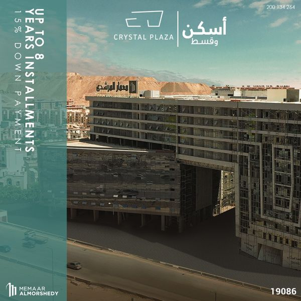

# OCR PFE Assignment 2023

## Introduction

This is a simple project to showcase your skills in the following areas:

-   Python or C/C++ programming
-   Coding style
-   Thinking process
-   Solving skills

## Problem statement

You are given a set of five images, each of which contains some text in various languages, sizes, orientations, and fonts. Your task is to extract the text from the images and output it in a text file.

- Data is in the `input` folder.

### Image samples

| Input 1                       | Input 3                       | Input 5                       |
| ----------------------------- | ----------------------------- | ----------------------------- |
|  |  |  |

## Requirements

-   You must use Python or C/C++.
-   Evaluate Character Segmentation and Recognition separately.
    -   Area of interest detection.
    -   Detection per area of interest. (Optional)
-   Validation using Character Error Rate (CER) and Word Error Rate (WER).
    -   https://github.com/jitsi/jiwer
    -   https://github.com/kahne/fastwer
-   You are free to use any open-source library or tool.
-   Processing speed is a **plus**.

## Evaluation

-   The quality of your code will be taken into account.
-   The evaluation will be based on the CER and WER of your solution.

## Submission

- Fork this repository.
- Add your code to the `src` folder.
- Generate a `output.json` file in the `output` folder.
  - ```json
    {
      "input_1.png": [
        "This is a sample text",
        "This is another sample text"
      ], # You can add more lines if needed, or more complex data structures
    }
    ```
- Add small note in the `README.md` file on how to run your code.
- When you are done, create a pull request to this repository.
- Request a review from @omarmhaimdat

## How to run the code

Add your instructions here.
